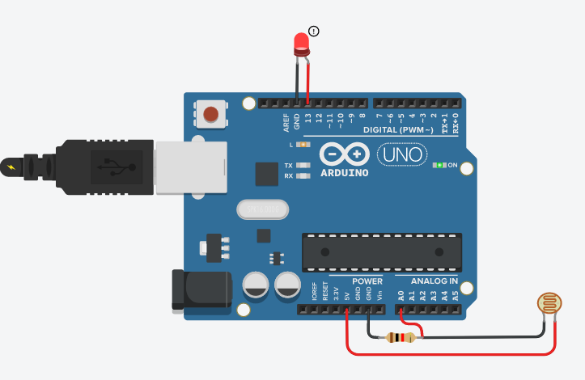

# T-rex_player

T-rex_player is a simple Arduino-based autonomous google chrome T-rex mini game player. It uses LDR (Light Dependent Resistor) as a sensor to sense the obstacle and Relay as an actuator to simulate human touch.

## Components Used

1. Arduino Uno
2. LDR
3. Resistor 1K ohm
3. Relay 5V
4. Coin

The components used in actual project may not match the components used in Tinkercad Simulation.

## Tinkercad Schematic

## Working

The connections are made as shown in the above figure. Here The relay and coin part is replaced with led as those components are not available in Tinkercad. LDR and 1K resistor are used as a voltage divider. As light falls on the LDR from the screen its resistance drops this increases potential between the junction of resistor and LDR. Arduino converts the analog signal to 10-bit digital signal so the value ranges from 0 - 1023. I have used 200 as the threshold for the obstacle as the brightness value drops below 200 pin-13 is set (HIGH) which activates the relay and simulates the touch making the dino jump.

## Watch The Video

  

